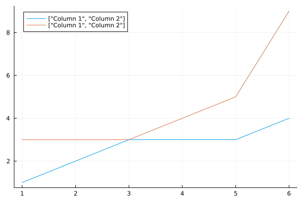
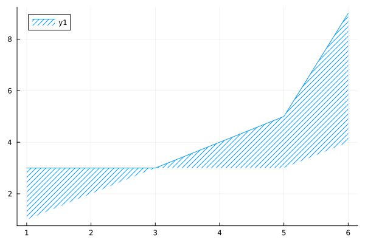
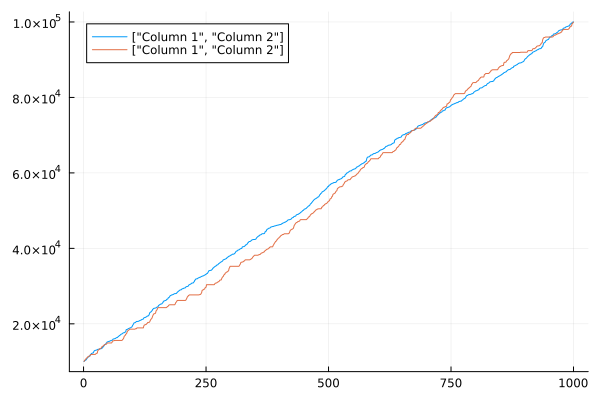

# Day 1: Historian Hysteria

## Part 1

### Working with Sample Data

OK, this is day one of Advent of Code 2024.  I'm creating my solutions in
Julia. I'm no Julia expert, so this is just good practice for me to sharpen my
Julia skills.

Let's get started.  The [instructions for day 1](https://adventofcode.com/2024/day/1) give the following
sample input:

````julia
sample = [
    3 4;
    4 3;
    2 5;
    1 3;
    3 9;
    3 3
]
````

````
6×2 Matrix{Int64}:
 3  4
 4  3
 2  5
 1  3
 3  9
 3  3
````

The goal of this project is to effectively come up with a metric for the
computing the distance between the two columns.  Compared to something like a
straight $L_2$ norm or something, for this exercise we first sort each column
(*independently*) in ascending order.  As a result, we get this for the first
column:

````julia
col1 = sort(sample[:, 1])
````

````
6-element Vector{Int64}:
 1
 2
 3
 3
 3
 4
````

and then for the second column we get:

````julia
col2 = sort(sample[:, 2])
````

````
6-element Vector{Int64}:
 3
 3
 3
 4
 5
 9
````

Now, we want to take sum up the absolute value of the difference between each
row in each of these columns.  First, let's write an expression that computes the
difference between each column.  This can be expressed in Julia quite simply
as:

````julia
col1 .- col2
````

````
6-element Vector{Int64}:
 -2
 -1
  0
 -1
 -2
 -5
````

Now, let's say we wanted the absolute value of each of these.  We can express
that by wrapping the whole expression with `abs.(...)`:

````julia
abs.(col1 .- col2)
````

````
6-element Vector{Int64}:
 2
 1
 0
 1
 2
 5
````

Finally, if we want to sum these numbers we would get:

````julia
sum(abs.(col1 .- col2))
````

````
11
````

Note the answer we get is $11$ which, according to the instructions is the correct
answer.  Now let's write a general function that can take in our original data and
return this sum to us:

````julia
function part1(data)
    col1 = sort(data[:, 1])
    col2 = sort(data[:, 2])
    return sum(abs.(col1 .- col2))
end
````

````
part1 (generic function with 1 method)
````

...testing this on the test data set gives us:

````julia
part1(sample)

### Working with Actual Data
````

````
11
````

Voila!  Our function works.  Now let's use the function the compute the solutions
for day one.  For _me_, the input data for day 1 can be found in [this file](./day1.txt).
We can read that data into Julia with:

````julia
using DelimitedFiles
data = readdlm("day1.txt", Int64);
````

Using our function to compute the result we get:

````julia
part1(data)
````

````
2164381
````

Sure enough, `2,164,381` is the correct answer for day 1!

````julia
### Visualization
````

Let's visualize what is going on here.  First, let's plot both of
the columns...

````julia
using Plots
plot([col1, col2], label=["Column 1", "Column 2"])
````


What we are interested in is the difference between these two data sets.
So let's break this down into the lower of the two values and the
upper for the two values:

````julia
lower = min.(col1, col2)
````

````
6-element Vector{Int64}:
 1
 2
 3
 3
 3
 4
````

and the upper values:

````julia
upper = max.(col1, col2)
````

````
6-element Vector{Int64}:
 3
 3
 3
 4
 5
 9
````

Now, let's plot these two values:

````julia
plot(upper, fillrange=lower, fillstyle=:/)
````


We can generate a similar plot for our actual data:

````julia
plot([sort(data[:, 1]), sort(data[:, 2])], label=["Column 1", "Column 2"])
````


So our calculation of `2,164,381` is the sum of the differences between
these two lines.

## Part 2

But wait, there is more.  Now we have to compute a *similarity score*.

### Working with Sample Data

Again, we start with the sample data but this time we want to
compute the similarity score.  Here is the sample data again:

````julia
sample = [
    3 4;
    4 3;
    2 5;
    1 3;
    3 9;
    3 3
]
````

````
6×2 Matrix{Int64}:
 3  4
 4  3
 2  5
 1  3
 3  9
 3  3
````

To compute the similarity score we need to take each number on the left, in
turn, and multiple it by the number of times it appears on the right, _i.e.,_

````julia
["$(x) * $(count(==(x), sample[:, 2])) = $(x * count(==(x), sample[:, 2]))" for x in sample[:, 1]]
````

````
6-element Vector{String}:
 "3 * 3 = 9"
 "4 * 1 = 4"
 "2 * 0 = 0"
 "1 * 0 = 0"
 "3 * 3 = 9"
 "3 * 3 = 9"
````

The products themselves are just:

````julia
[x * count(==(x), sample[:, 2]) for x in sample[:, 1]]
````

````
6-element Vector{Int64}:
 9
 4
 0
 0
 9
 9
````

And their sum is:

````julia
sum([x * count(==(x), sample[:, 2]) for x in sample[:, 1]])
````

````
31
````

And, as the [instructions for Day 2](https://adventofcode.com/2024/day/1#part2) tell us,
the answer should be $31$.

### Working with Actual Data

Our next step is to write a function that can do this calculation for
an arbitrary data set.  In Julia, such a function can be written as:

````julia
function part2(data)
    return sum([x * count(==(x), data[:, 2]) for x in data[:, 1]])
end
````

````
part2 (generic function with 1 method)
````

Let's test our function on the sample data just to make sure we got that
correct:

````julia
part2(sample)
````

````
31
````

Hurray!  Now, let's it on our actual data:

````julia
using DelimitedFiles
data = readdlm("day1.txt", Int64)

part2(data)
````

````
20719933
````

Excellent, another gold start, the expected answer is indeed `20719933`.  Now on to [Day 2](./day2).

---

*This page was generated using [Literate.jl](https://github.com/fredrikekre/Literate.jl).*

